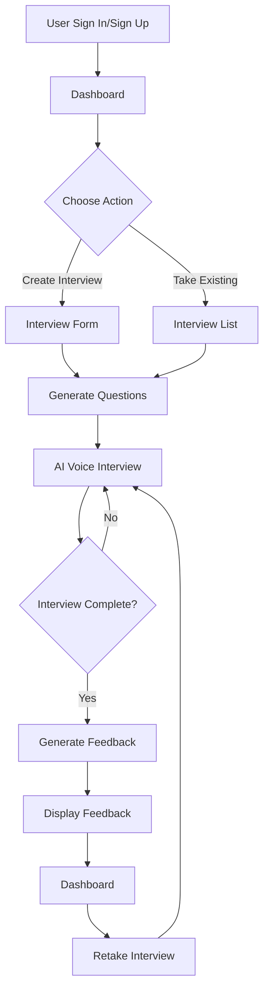

# 🎙️ HireSense

<div align="center">

**AI-Powered Interview Practice Platform**

Practice real interviews with AI and get instant, detailed feedback to improve your skills.

[Live Demo](https://hiresense-steel.vercel.app/) • [Report Bug](#) • [Request Feature](#)

</div>

---

## ✨ About HireSense

HireSense is an innovative AI-powered interview practice platform designed to help job seekers prepare for real interviews. By simulating authentic interview experiences with voice-based AI interviewers, users can practice their responses in a realistic environment and receive comprehensive, actionable feedback.

### 🎯 The Problem

Job interviews are stressful, and lack of practice often leads to poor performance. Traditional preparation methods (mock interviews with friends, reading common questions) don't provide the realism or feedback needed to truly improve. Candidates often don't know how they performed until it's too late.

### 💡 The Solution

HireSense solves this by providing:
- **Realistic voice interviews** with AI that sounds like a real interviewer
- **Instant, detailed feedback** across multiple assessment categories
- **Privacy-focused design** - your feedback is only visible to you
- **Customizable interviews** for different roles and tech stacks
- **Accessible anytime** - practice at your own pace, anywhere

### 🌟 Impact

- **For Job Seekers**: Build confidence, identify improvement areas, and perform better in real interviews
- **For Recruiters**: Better-prepared candidates mean more efficient hiring processes
- **For Learning**: Continuous improvement through repeated practice with detailed feedback

---

## 🚀 Features

### 🎤 AI Voice Interviews
- Real-time voice conversations with AI interviewers
- Natural speech using advanced text-to-speech technology
- Support for technical, behavioral, and mixed interview types
- Customizable questions based on role and tech stack

### 📊 Comprehensive Feedback
- **Overall Score** (0-100) for quick performance assessment
- **Category Breakdown** across 5 key areas:
  - Communication Skills
  - Technical Knowledge
  - Problem Solving
  - Cultural Fit
  - Confidence and Clarity
- **Strengths & Areas for Improvement** with specific recommendations
- **Final Assessment** with overall evaluation

### 🔒 Privacy & Security
- User authentication with Firebase
- Feedback visibility restricted to interview owner only
- Secure session management
- Data stored in encrypted Firestore database

### 🎨 User Experience
- Clean, modern interface built with shadcn/ui
- Responsive design for all devices
- Real-time loading states and progress indicators
- Intuitive interview creation and management

---

## 🛠️ Tech Stack

### Frontend & UI
- **Next.js 16** - React framework with App Router for modern web development
- **React 19** - Latest React for building interactive user interfaces
- **Tailwind CSS 4** - Utility-first CSS framework for rapid styling
- **shadcn/ui** - Beautiful, accessible component library
- **Lucide React** - Consistent icon set for the interface

### AI & Voice Technology
- **Vapi AI** - Real-time voice AI platform enabling natural conversations
- **Google Gemini 2.5 Flash** - Advanced AI model for generating detailed interview feedback
- **Deepgram** - State-of-the-art speech-to-text transcription
- **11Labs** - High-quality text-to-speech voice synthesis

### Backend & Database
- **Firebase** - Complete backend solution including:
  - Authentication - Secure user sign-in/sign-up
  - Firestore - NoSQL database for storing interviews and feedback
- **Firebase Admin SDK** - Server-side Firebase operations
- **Next.js API Routes** - Server actions for secure backend operations

### Form Handling & Validation
- **React Hook Form** - Efficient form management with minimal re-renders
- **Zod** - TypeScript-first schema validation
- **@hookform/resolvers** - Seamless integration between form and validation libraries

### Utilities
- **dayjs** - Lightweight date manipulation and formatting
- **clsx & tailwind-merge** - Conditional class name utilities
- **TypeScript** - Type-safe JavaScript development

---

## 📋 Application Flow



### User Journey

1. **Authentication** - Sign in or create an account
2. **Dashboard** - View your interviews and available practice interviews
3. **Interview Selection** - Choose to create a new interview or take an existing one
4. **AI Interview** - Engage in a voice conversation with the AI interviewer
5. **Feedback Generation** - AI analyzes your responses and generates detailed feedback
6. **Review & Improve** - View your feedback, identify strengths and weaknesses
7. **Practice Again** - Retake interviews to track improvement over time

---

## 🚀 Getting Started

### Prerequisites

- Node.js 18+ installed
- npm, yarn, or pnpm package manager
- A Firebase project (free tier works)
- Vapi AI account with API key
- Google AI API key

### Installation

1. **Clone the repository**
```bash
git clone https://github.com/yourusername/hiresense.git
cd hiresense
```

2. **Install dependencies**
```bash
npm install
# or
yarn install
# or
pnpm install
```

3. **Set up environment variables**

Create a `.env.local` file in the root directory:

```env
# Firebase Configuration
NEXT_PUBLIC_FIREBASE_API_KEY=your_firebase_api_key
NEXT_PUBLIC_FIREBASE_AUTH_DOMAIN=your_project.firebaseapp.com
NEXT_PUBLIC_FIREBASE_PROJECT_ID=your_project_id
NEXT_PUBLIC_FIREBASE_STORAGE_BUCKET=your_project.appspot.com
NEXT_PUBLIC_FIREBASE_MESSAGING_SENDER_ID=your_sender_id
NEXT_PUBLIC_FIREBASE_APP_ID=your_app_id

# Firebase Admin SDK (for server-side operations)
FIREBASE_PROJECT_ID=your_project_id
FIREBASE_CLIENT_EMAIL=your_service_account_email
FIREBASE_PRIVATE_KEY=your_service_account_private_key

# Vapi AI Configuration
NEXT_PUBLIC_VAPI_WEB_TOKEN=your_vapi_web_token
NEXT_PUBLIC_VAPI_ASSISTANT_ID=your_vapi_assistant_id

# Google AI Configuration
GOOGLE_GENERATIVE_AI_API_KEY=your_google_ai_api_key
```

4. **Run the development server**
```bash
npm run dev
# or
yarn dev
# or
pnpm dev
```

5. **Open your browser**
Navigate to [http://localhost:3000](http://localhost:3000)

---

## 🔧 Environment Variables Guide

### Firebase Setup

1. Go to [Firebase Console](https://console.firebase.google.com/)
2. Create a new project
3. Enable Authentication (Email/Password provider)
4. Create a Firestore database
5. In Project Settings, get your web app configuration
6. For Admin SDK, generate a service account key and download the JSON file

### Vapi AI Setup

1. Sign up at [Vapi AI](https://vapi.ai/)
2. Create an assistant in the dashboard
3. Get your API token and assistant ID
4. Configure the assistant with the settings in `constants/index.ts`

### Google AI Setup

1. Go to [Google AI Studio](https://makersuite.google.com/)
2. Create an API key
3. Enable the Gemini API
4. Copy your API key to the environment variables

---

## 📁 Project Structure

```
hiresense/
├── app/                      # Next.js App Router
│   ├── (auth)/              # Authentication routes
│   │   ├── sign-in/         # Sign in page
│   │   └── sign-up/         # Sign up page
│   ├── (root)/              # Protected routes
│   │   ├── interview/       # Interview pages
│   │   │   ├── [id]/        # Individual interview
│   │   │   └── [id]/feedback/ # Feedback page
│   │   └── page.tsx         # Dashboard
│   ├── layout.tsx           # Root layout
│   └── globals.css          # Global styles
├── components/              # React components
│   ├── Agent.tsx            # AI interviewer component
│   ├── Header.tsx           # Navigation header
│   ├── InterviewCard.tsx    # Interview card display
│   └── ui/                  # shadcn/ui components
├── constants/               # Application constants
│   └── index.ts             # Interviewer config, schemas
├── firebase/                # Firebase configuration
│   ├── admin.ts             # Admin SDK setup
│   └── client.ts            # Client SDK setup
├── lib/                     # Utility functions
│   ├── actions/             # Server actions
│   │   ├── auth.action.ts   # Authentication logic
│   │   └── general.action.ts # General operations
│   ├── utils.ts             # Helper functions
│   └── vapi.sdk.ts          # Vapi SDK initialization
├── types/                   # TypeScript type definitions
│   └── index.d.ts           # Global types
└── public/                  # Static assets
```

---

## 📖 Usage Guide

### Creating an Account

1. Visit the application
2. Click "Sign Up" on the login page
3. Enter your name, email, and password
4. Verify your email if required
5. You're now ready to start practicing!

### Taking an Interview

1. From the dashboard, click "Start Interview" or select an existing interview
2. Fill in the interview details:
   - Role (e.g., Frontend Developer)
   - Level (Junior, Mid, Senior)
   - Type (Technical, Behavioral, Mixed)
   - Tech stack (e.g., React, TypeScript)
3. Click "Generate Interview"
4. Click "Call" to开始 the voice interview
5. Answer the AI interviewer's questions naturally
6. Click "End" when finished
7. Wait for feedback generation
8. Review your detailed feedback

### Understanding Your Feedback

- **Total Score**: Overall performance (0-100)
- **Category Scores**: Performance in specific areas
- **Strengths**: What you did well
- **Areas for Improvement**: Specific recommendations
- **Final Assessment**: Overall evaluation

### Retaking Interviews

- Click "Retake Interview" on the feedback page
- This generates a new AI interview with the same parameters
- Compare your new feedback with previous attempts to track progress

---

## 🌐 Live Demo

Check out the live application at: [https://hiresense-steel.vercel.app/](https://hiresense-steel.vercel.app/)

---

## 🚀 Deployment

### Deploying to Vercel

1. Push your code to GitHub
2. Go to [Vercel](https://vercel.com/)
3. Import your repository
4. Add environment variables in Vercel dashboard
5. Deploy!

### Environment Variables in Production

Make sure all environment variables from `.env.local` are added to your hosting platform's environment settings.

---

## 🔮 Future Improvements

- [ ] **Video Interviews** - Add video capability for more realistic practice
- [ ] **Interview History Analytics** - Track progress over time with charts
- [ ] **Community Interviews** - Share and discover interview templates
- [ ] **Multi-language Support** - Support interviews in different languages
- [ ] **Mobile App** - Native iOS and Android applications
- [ ] **Integration with ATS** - Connect with applicant tracking systems
- [ ] **Company-specific Interviews** - Custom interviews for specific companies
- [ ] **Peer Review** - Option to get feedback from human mentors
- [ ] **Interview Recording** - Save and replay interview sessions
- [ ] **Advanced Analytics** - Detailed performance metrics and trends

---

## 🛠️ Troubleshooting

### Common Issues

**Issue: Firebase authentication not working**
- Ensure all Firebase environment variables are set correctly
- Check that Authentication is enabled in Firebase Console
- Verify Email/Password provider is enabled

**Issue: Vapi AI not connecting**
- Check that `NEXT_PUBLIC_VAPI_WEB_TOKEN` is valid
- Ensure your Vapi assistant is properly configured
- Verify the assistant ID matches your Vapi dashboard

**Issue: Feedback generation fails**
- Check that `GOOGLE_GENERATIVE_AI_API_KEY` is valid
- Ensure the Gemini API is enabled in Google AI Studio
- Verify your API key has the necessary permissions

**Issue: Build errors with Firebase Admin**
- Ensure `serverExternalPackages: ['firebase-admin']` is in `next.config.ts`
- Check that Firebase Admin credentials are correctly formatted
- Verify the private key has proper line breaks

**Issue: Styling not loading**
- Ensure Tailwind CSS is properly installed
- Check that `tailwind.config.ts` is configured correctly
- Verify `globals.css` is imported in the root layout

### Getting Help

If you encounter issues not covered here:
- Check the [Next.js documentation](https://nextjs.org/docs)
- Review [Firebase documentation](https://firebase.google.com/docs)
- Visit [Vapi AI documentation](https://docs.vapi.ai/)
- Open an issue on GitHub

---

## 🤝 Contributing

Contributions are welcome! Here's how you can help:

1. Fork the repository
2. Create a feature branch (`git checkout -b feature/amazing-feature`)
3. Commit your changes (`git commit -m 'Add amazing feature'`)
4. Push to the branch (`git push origin feature/amazing-feature`)
5. Open a Pull Request

### Development Guidelines

- Follow the existing code style
- Write meaningful commit messages
- Test your changes thoroughly
- Update documentation as needed

---

## 📄 License

This project is licensed under the MIT License - see the LICENSE file for details.

---

## 🙏 Acknowledgments

- **Next.js** - The React framework for production
- **Firebase** - Backend-as-a-Service platform
- **Vapi AI** - Voice AI platform
- **Google AI** - Gemini AI model
- **shadcn/ui** - Beautiful component library
- **Tailwind CSS** - Utility-first CSS framework

---

<div align="center">

**Built with ❤️ for job seekers everywhere**

[⬆ Back to Top](#-hiresense)

</div>
